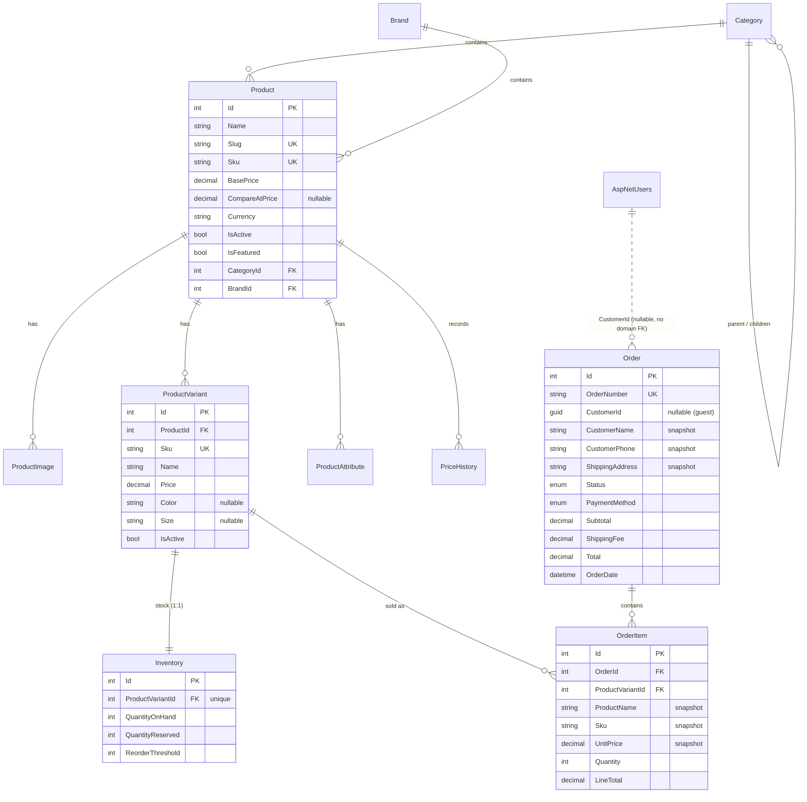

# Implementation Report — Livora (Demo Retail E-commerce)

A short report on how this tool was designed and implemented: architecture, technology stack, database design, API surface, configuration, known limitations, and proposed improvements.

- 📦 Postman collection: [`docs/RetailEcommerce.postman_collection.json`](RetailEcommerce.postman_collection.json)
- 🛠 Backend report (architecture, stack, limitations, improvements): [`backend.md`](backend.md)
- 🎨 Frontend report (stack, versions, limitations, improvements): [`frontend.md`](frontend.md)
- 🚀 Setup & run guide: [`README.en.md`](../README.en.md) ([Tiếng Việt](../README.md))

---

## 1. Approach

The goal was a small but production-shaped retail e-commerce system: a customer storefront (browse → cart → COD checkout → order history) and an admin panel (products, orders, users), built so each concern lives in the right layer and the demo could grow into a real product.

Key decisions:

- **Clean Architecture** on the backend. Four projects with a strict inward dependency flow — `Api → Infrastructure → Application → Domain`. The Domain layer has zero dependencies; business rules (stock checks, shipping fee, order numbering) live in Application services behind interfaces; EF Core, Identity, and JWT issuance are Infrastructure details.
- **Repository pattern + Unit of Work** so Application services never touch `DbContext` directly, keeping them unit-testable.
- **Identity kept out of the Domain.** `ApplicationUser` (ASP.NET Core Identity) lives in Infrastructure; `Order` references the buyer only through a nullable `CustomerId (Guid)`. This keeps the Domain pure and makes guest checkout natural.
- **Snapshot-based orders.** `Order` copies contact/shipping info and `OrderItem` copies product name, SKU, and unit price at purchase time, so historical orders stay correct when the catalogue changes later.
- **Zero-friction startup.** On boot the API applies EF Core migrations and seeds demo data (admin + customer accounts, categories, brands, products with variants and stock), so a reviewer only needs PostgreSQL and `dotnet run`.
- **Signals-first Angular frontend** with standalone components; the cart is a signal store persisted to `localStorage`, and route guards + an HTTP interceptor handle JWT auth and the admin area.

## 2. Technology stack

| Layer | Technology |
|---|---|
| API | ASP.NET Core 10 Web API, Swagger (Swashbuckle) |
| Architecture | Clean Architecture, Repository + Unit of Work, DI |
| Data | EF Core 10 + Npgsql (PostgreSQL 13+), code-first migrations |
| AuthN/AuthZ | ASP.NET Core Identity + JWT bearer, role-based (`Admin`, `Customer`) |
| Validation / mapping | FluentValidation (via an MVC filter), AutoMapper 13.0.1 |
| Cross-cutting | Global exception-handling middleware, audit `SaveChanges` interceptor, global soft-delete query filters |
| Frontend | Angular 20 (standalone components), TypeScript 5.9, Angular Material, Signals, Reactive Forms, RxJS |
| Tooling | Node 20+, .NET SDK 10, `dotnet-ef` CLI |

## 3. Database design

PostgreSQL, code-first via EF Core. All domain tables inherit an `AuditableEntity` base: `Id`, `CreatedAt/By`, `UpdatedAt/By`, plus soft delete (`IsDeleted`, `DeletedAt`) enforced by global query filters. Identity tables (`AspNetUsers`, `AspNetRoles`, …) are standard ASP.NET Core Identity with `Guid` keys.

Design notes:

- **Variant-level selling.** A `Product` is catalogue information with a base/list price; the purchasable unit is the `ProductVariant` (own SKU and price, flat `Color`/`Size` options) with a 1:1 `Inventory` row. Sellable quantity is computed as `QuantityOnHand − QuantityReserved`.
- **Hierarchical categories** via a self-referencing `ParentCategoryId`.
- **Price history.** Every `BasePrice` change on update is appended to `PriceHistory` with an optional reason.
- **Order lifecycle.** `Status`: `Pending → Confirmed → Processing → Shipped → Delivered` (or `Cancelled`; a cancelled order cannot be re-opened). `PaymentMethod` currently has the single value `CashOnDelivery`.
- **Checkout flow** (in `OrderService.CreateAsync`): merge duplicate cart lines per variant → validate variant is active and stock is sufficient → decrement `QuantityOnHand` → snapshot line data → compute shipping (flat 30,000₫, free for subtotals ≥ 500,000₫) → generate a daily-sequence order number → save everything in one `SaveChanges` transaction.

## 4. API overview

Base URL `http://localhost:5080/api`, JSON only, enums serialized as strings. Errors are normalized by middleware (404 not found, 409 business-rule conflicts, 400 validation failures).

| Area | Endpoints | Access |
|---|---|---|
| Auth | `POST /auth/register`, `POST /auth/login`, `GET /auth/me` | Public / Public / Authenticated |
| Products | `GET /products` (paged + filters), `GET /products/{id}`, `GET /products/slug/{slug}` | Public |
| | `POST /products`, `PUT /products/{id}`, `DELETE /products/{id}` | Admin |
| Categories | `GET /categories`, `GET /categories/tree`, `GET /categories/{id}` | Public |
| | `POST/PUT/DELETE /categories/{id}` | Admin |
| Brands | `GET /brands`, `GET /brands/{id}` | Public |
| | `POST/PUT/DELETE /brands/{id}` | Admin |
| Orders | `POST /orders` (checkout, guest or logged-in) | Public |
| | `GET /orders/my`, `GET /orders/{id}` (own orders only) | Authenticated |
| | `GET /orders` (paged), `PUT /orders/{id}/status` | Admin |
| Users | `GET /users`, `GET /users/roles`, `GET /users/{id}`, `PUT /users/{id}/roles`, `PUT /users/{id}/lockout` | Admin |

### Postman collection

Import [`docs/RetailEcommerce.postman_collection.json`](RetailEcommerce.postman_collection.json) into Postman:

1. Start the backend, then run **Auth → Login (Admin)** (or **Login (Customer)**).
2. The login test script stores the JWT in the `token` collection variable; all protected requests inherit `Bearer {{token}}` automatically.
3. `baseUrl` defaults to `http://localhost:5080` — change the collection variable if you run elsewhere.

Seeded demo accounts: `admin@retail.local` / `Admin@123` and `khachhang@retail.local` / `Customer@123`. Swagger UI is also available at `http://localhost:5080/swagger` in Development.

## 5. Configuration & environment variables

All settings live in `backend/src/RetailEcommerce.Api/appsettings.json` and can be overridden per standard ASP.NET Core configuration with environment variables (use `__` as the section separator):

| Environment variable | Purpose | Default / note |
|---|---|---|
| `ConnectionStrings__DefaultConnection` | PostgreSQL connection string | `Host=localhost;Port=5432;Database=DemoEcommerce;Username=postgres;Password=...` — **required**; DB is created/migrated on startup |
| `Jwt__Key` | JWT signing key | **Required in production** — replace the placeholder; must be ≥ 32 characters |
| `Jwt__Issuer` / `Jwt__Audience` | Token issuer/audience | `RetailEcommerce` / `RetailEcommerce.Client` |
| `Jwt__ExpiryMinutes` | Token lifetime | `480` (8 h) |
| `Cors__AllowedOrigins__0` | Allowed frontend origin(s) | `http://localhost:4200` (add `__1`, `__2`… for more) |
| `Seed__AdminEmail` / `Seed__AdminPassword` | Seeded admin credentials | `admin@retail.local` / `Admin@123` |
| `ASPNETCORE_ENVIRONMENT` | Environment name | `Development` enables Swagger UI |
| `ASPNETCORE_URLS` | Listening URL(s) | `http://localhost:5080` via `launchSettings.json` |

The frontend needs no environment variables: the API base URL is a compile-time constant in `frontend/src/app/core/config.ts` (a limitation noted below).

## 6. Limitations

- **COD only, no payments.** Checkout records the order; there is no payment gateway, no payment status, and no refund flow.
- **No token refresh or revocation.** A single JWT valid for 8 hours; logout is client-side only, and locking a user does not invalidate tokens already issued.
- **Stock handling is simplistic.** `QuantityOnHand` is decremented at order time with no row locking or optimistic-concurrency token, so two simultaneous checkouts of the last unit could oversell. `QuantityReserved` exists in the schema but no reservation flow uses it, and cancelling an order does not restock.
- **Images are external URLs only** (seeded from `picsum.photos`); there is no upload pipeline or media storage.
- **Client-side cart.** The cart lives in `localStorage` and is not merged into the account on login or shared across devices.
- **Basic search.** Product search is a simple case-insensitive `LIKE`; no full-text search, ranking, or faceting.
- **Frontend API URL is compiled in** (`config.ts`), so pointing the client at another backend requires a rebuild.
- **Single currency/locale.** Prices are VND with UI text in Vietnamese; no i18n framework.
- **No automated tests, containers, or CI.** There is no backend test project, no Dockerfile/compose, and no pipeline. (The `Program` class is exposed as `partial` to make integration tests possible later.)
- **Missing production hardening**: no rate limiting, email confirmation, password reset, health checks, or structured observability.
- **AutoMapper 13.0.1 carries advisory `NU1903`** — pinned deliberately as the last MIT-licensed version.

## 7. Future improvements

Ordered roughly by value:

1. **Payment gateway integration** (VNPay/MoMo/Stripe) with payment status on orders and a webhook-driven confirmation flow.
2. **Robust inventory**: use `QuantityReserved` for a reserve-on-checkout / release-on-cancel flow, add an EF concurrency token (`xmin`) to prevent oversell, and restock on cancellation.
3. **Auth hardening**: refresh tokens with rotation and server-side revocation, email confirmation, password reset, rate limiting on auth endpoints.
4. **Server-side cart** persisted per account, merged with the guest cart at login.
5. **Media uploads** to object storage (S3/Azure Blob) with resizing, replacing URL-only images.
6. **Search & performance**: PostgreSQL full-text search (`tsvector`) for products, Redis caching for the catalogue, response compression.
7. **Testing & delivery**: unit tests for Application services, integration tests with Testcontainers (PostgreSQL), Dockerfile + docker-compose, CI/CD pipeline.
8. **Observability**: health checks, structured logging (Serilog), OpenTelemetry traces/metrics.
9. **Frontend runtime configuration** (environment files or a config endpoint) and i18n (vi/en).
10. **Admin analytics**: revenue charts, best-sellers, low-stock alerts (the `ReorderThreshold` column is already in place).
