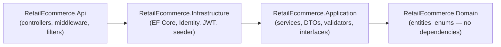

# Backend Report — Livora (Demo Retail E-commerce)

Short report covering the implementation approach, technology stack, versions, limitations, and proposed improvements of the **ASP.NET Core Web API** backend.

- 📋 Overall implementation report: [`REPORT.md`](REPORT.md)
- 🎨 Frontend report: [`frontend.md`](frontend.md)
- 📦 Postman collection: [`RetailEcommerce.postman_collection.json`](RetailEcommerce.postman_collection.json)
- 🚀 Setup & run guide: [`README.en.md`](../README.en.md) ([Tiếng Việt](../README.md))

---

## 1. Implementation Approach

The backend is a JSON Web API serving both the public storefront and the role-protected admin panel: catalogue (products, categories, brands), COD checkout, order management, and user administration on PostgreSQL.

### Guiding principles

| Principle | How it is applied |
|---|---|
| **Clean Architecture** | Four projects with a strict inward dependency rule (`Api → Infrastructure → Application → Domain`). Domain has zero NuGet dependencies; business rules live in Application services behind interfaces; EF Core, Identity, and JWT are Infrastructure details. |
| **Thin controllers, smart services** | Controllers only resolve a service interface, pass DTOs through, and translate results to HTTP (`Ok`, `CreatedAtAction`, `NoContent`). All logic sits in Application services. |
| **Cross-cutting by convention, not per-endpoint** | A `SaveChanges` interceptor stamps audit fields and rewrites deletes as soft deletes; global query filters hide soft-deleted rows; one middleware normalizes all errors; one action filter runs FluentValidation — new endpoints inherit all of it for free. |
| **Identity kept out of the Domain** | `ApplicationUser` lives in Infrastructure; `Order` references the buyer only via nullable `CustomerId (Guid)` — keeps the Domain pure and makes guest checkout natural. |
| **Snapshot-based orders** | Orders copy contact/shipping info; order items copy product name, SKU, and unit price — historical orders stay correct when the catalogue changes. |
| **Zero-friction startup** | On boot the API applies migrations and seeds roles, demo accounts, and a full catalogue, so a reviewer only needs PostgreSQL and `dotnet run`. |

### Project structure



```
RetailEcommerce.Domain/           # Pure C# — no NuGet dependencies
  Common/AuditableEntity.cs       #   Id + audit fields + soft-delete flags (base of every entity)
  Entities/                       #   Category, Brand, Product, ProductImage, ProductVariant,
                                  #   Inventory, ProductAttribute, PriceHistory, Order, OrderItem
  Enums/                          #   OrderStatus, PaymentMethod

RetailEcommerce.Application/      # Business logic — depends only on Domain
  Common/                         #   AppRoles, PagedQuery/PagedResult, SlugGenerator, exceptions
  DTOs/                           #   Request/response contracts per feature area
  Interfaces/                     #   Service + repository + auth abstractions
  Mapping/MappingProfile.cs       #   AutoMapper entity→DTO maps
  Services/                       #   CategoryService, BrandService, ProductService, OrderService
  Validators/                     #   FluentValidation validators for every input DTO

RetailEcommerce.Infrastructure/   # Implementation details — EF Core, Identity, JWT
  Authentication/                 #   JwtSettings, TokenService, AuthService
  Identity/                       #   ApplicationUser/ApplicationRole (Guid keys), UserService
  Persistence/                    #   ApplicationDbContext, entity configurations, interceptors,
                                  #   repositories, migrations, DbSeeder
  DependencyInjection.cs          #   DbContext + Identity + JWT bearer + repository registration

RetailEcommerce.Api/              # HTTP edge — thin controllers only
  Controllers/                    #   Auth, Products, Categories, Brands, Orders, Users
  Filters/FluentValidationFilter.cs
  Middleware/ExceptionHandlingMiddleware.cs
  Services/CurrentUserService.cs  #   Caller identity from HttpContext claims
  Program.cs                      #   Composition root + startup migrate/seed
```

### Request pipeline

Configured in `Program.cs`, in order:

1. **`ExceptionHandlingMiddleware`** — outermost; converts exceptions to RFC 7807 `application/problem+json`.
2. **Swagger** (Development only) — UI at `/swagger` with a JWT bearer input.
3. **CORS** — origins from `Cors:AllowedOrigins` (default `http://localhost:4200`).
4. **Authentication → Authorization** — JWT bearer, role-based `[Authorize]`.
5. **Controllers** — global `FluentValidationFilter` + `JsonStringEnumConverter` (enums travel as strings, e.g. `"status": "Confirmed"`).

Before serving, `DbSeeder.SeedAsync` migrates and seeds; a failure is logged and rethrown so the app refuses to start on a broken database.

### Authentication & authorization

- **ASP.NET Core Identity** (`Guid` keys, tables renamed to `Users`, `Roles`, …) in the same PostgreSQL database. Password policy: min length 6 + digit, unique email. Lockout: 5 failed attempts → 15 minutes.
- **Two roles** (`AppRoles`): `Admin`, `Customer`. Registration always assigns `Customer`; admins change roles via `PUT /api/users/{id}/roles`.
- **JWT** (`TokenService`): HMAC-SHA256; claims `sub`, `nameidentifier`, `name`, `email`, `jti` + one role claim per role; expiry from `Jwt:ExpiryMinutes` (default 480). Validation checks issuer, audience, signature, lifetime (1-minute clock skew). Startup throws if `Jwt:Key` < 32 chars.
- **`CurrentUserService`** exposes the caller's id/name/roles from `HttpContext.User` to lower layers via `ICurrentUserService` — this drives guest-vs-customer checkout, "my orders" filtering, and audit stamping.

### Data access

- **`ApplicationDbContext`** extends `IdentityDbContext` and **implements `IUnitOfWork`** — services call `SaveChangesAsync()` once per use case; everything commits atomically.
- **Repositories**: generic `RepositoryBase<T>` (tracked `GetByIdAsync`; no-tracking list/find) plus aggregate-specific repositories with eager-loading and paged/filtered queries.
- **Audit interceptor**: stamps `CreatedAt/By`, `UpdatedAt/By` (user from claims, else `"system"`) and **rewrites hard deletes into soft deletes** — `Remove()` never issues SQL `DELETE`.
- **Global soft-delete query filter** (`e => !e.IsDeleted`) applied to every `AuditableEntity` subtype.
- **Indexes**: unique on product/category/brand `Slug`, product `Sku`, `OrderNumber`, and `Inventory.ProductVariantId` (1:1); lookup indexes on FKs and `Order.Status`.

### Validation & error handling

| Source | Result |
|---|---|
| `FluentValidationFilter` — runs the registered `IValidator<T>` for each action argument | `400` `ValidationProblemDetails` with per-field errors |
| `NotFoundException` from services | `404` problem details |
| `ConflictException` — business-rule violations (out of stock, inactive product, invalid status transition, duplicate slug/SKU) | `409` problem details |
| `UnauthorizedAccessException` | `401` problem details |
| Anything else | `500`, generic message + `traceId` (details logged, never leaked) |

### Key business rules

- **Checkout** (`OrderService.CreateAsync`): merge duplicate cart lines per variant → variant must exist, be active, and have `QuantityAvailable` (= on-hand − reserved) ≥ requested → decrement `QuantityOnHand` → snapshot line data → compute totals → one `SaveChangesAsync` persists order + stock atomically. Guests (`CustomerId = null`) and logged-in customers use the same endpoint.
- **Shipping fee**: flat 30,000₫, free for subtotals ≥ 500,000₫ (constants in `OrderService`, mirrored by the frontend).
- **Order numbers**: `OD{yyyyMMdd}-{seq:D4}` — daily sequence from a per-day count, protected by a unique index.
- **Status transitions**: admins may set any status, except a `Cancelled` order can never be re-opened (cancelling does not restock — see limitations).
- **Product updates**: `Images`/`Variants`/`Attributes` are *synced* (rows with `Id` updated, without `Id` inserted, omitted rows soft-deleted). A `BasePrice` change appends a `PriceHistory` row with an optional reason.
- **Slugs**: auto-generated from the name via `SlugGenerator` when not supplied; uniqueness enforced.

### Migrations & seeding

`DbSeeder.SeedAsync` runs at startup: `MigrateAsync()` → ensure `Admin`/`Customer` roles → seed admin (`Seed:AdminEmail`/`Seed:AdminPassword`) and demo customer → seed catalogue (categories, brands, products with images, variants, attributes, stock) if empty.

Manual workflow (from `backend/`):

```bash
dotnet ef database update --project src/RetailEcommerce.Infrastructure --startup-project src/RetailEcommerce.Api
dotnet ef migrations add <Name> --project src/RetailEcommerce.Infrastructure --startup-project src/RetailEcommerce.Api --output-dir Persistence/Migrations
```

### Extending the backend — checklist

1. **Domain** — entity inheriting `AuditableEntity` + navigation properties.
2. **Infrastructure** — `DbSet` on the context, entity configuration, migration (audit + soft delete come free).
3. **Application** — DTOs, validator (auto-registered by assembly scan), AutoMapper maps, service + repository interfaces, service implementation, DI registration.
4. **Infrastructure** — repository implementation (extend `RepositoryBase<T>`), DI registration.
5. **Api** — thin controller with `[AllowAnonymous]` / `[Authorize(Roles = AppRoles.Admin)]` per action.

---

## 2. Technology Stack & Versions

| Layer | Technology | Version |
|---|---|---|
| Runtime / framework | **.NET / ASP.NET Core Web API** | **10.0** (`net10.0`) |
| ORM | EF Core + Npgsql provider | 10.0.10 / 10.0.3 |
| Database | PostgreSQL | 13+ (dev on default port 5432) |
| Identity & auth | ASP.NET Core Identity + JWT bearer | 10.0.10 |
| Validation | FluentValidation (+ DI extensions) | 12.1.1 |
| Mapping | AutoMapper | 13.0.1 (last MIT version — pinned; carries advisory `NU1903`) |
| API docs | Swashbuckle (Swagger UI) | 10.2.3 |
| Migrations tooling | `dotnet-ef` CLI | 10.0.10 |

Frontend counterpart: Angular 20.3 · TypeScript 5.9 · Angular Material — see [`frontend.md`](frontend.md).

---

## 3. Limitations

Known constraints of the current implementation — deliberate scope cuts for a demo, listed honestly:

1. **COD only, no payments.** Checkout records the order; there is no payment gateway, payment status, or refund flow (`PaymentMethod` has a single value).
2. **No refresh tokens or revocation.** One 8-hour JWT; logout is client-side only, and locking a user does **not** invalidate tokens already issued — a locked-out user keeps API access until expiry.
3. **Stock is not concurrency-safe.** The check-then-decrement in checkout has no row locking or optimistic-concurrency token, so two simultaneous orders for the last unit can oversell. `QuantityReserved` exists in the schema but no reservation flow uses it, and cancelling an order does not restock.
4. **Order-number generation can collide under load.** The daily sequence comes from a count query; two concurrent checkouts can compute the same number — the unique index makes the loser fail with a 500 rather than corrupt data.
5. **Basic search.** Product search is a case-insensitive `LIKE`; no full-text search, ranking, or facets.
6. **No media pipeline.** Product images are external URL strings (seeded from picsum.photos); no upload or storage.
7. **No automated tests.** No backend test project exists (`Program` is exposed as `partial` to enable integration tests later, but none are written).
8. **No containers or CI/CD.** No Dockerfile/compose; database must be installed locally.
9. **Missing production hardening.** No rate limiting, email confirmation, password reset, health checks, or structured observability; Swagger is Development-only but error messages assume a trusted client.
10. **Single-instance assumptions.** Startup migrate+seed and count-based order numbering assume one API instance; horizontal scaling would need distributed migration locking and a sequence-based order number.

---

## 4. Future Improvements

Ordered roughly by value-for-effort:

1. **Concurrency-safe inventory** — add PostgreSQL `xmin` as an EF concurrency token (or `SELECT … FOR UPDATE`), use `QuantityReserved` for a reserve-on-checkout / release-on-cancel flow, and restock on cancellation. *(small change, closes the most real bug)*
2. **Database-backed order numbers** — a PostgreSQL sequence per day (or globally) instead of count+1, eliminating the collision window.
3. **Payment gateway** — VNPay / MoMo / Stripe with payment status on orders and webhook-driven confirmation.
4. **Auth hardening** — short-lived access tokens + rotating refresh tokens with server-side revocation (fixes the lockout gap), email confirmation, password reset, rate limiting on auth endpoints.
5. **Testing & delivery** — unit tests for Application services (repositories mock cleanly behind interfaces), integration tests with Testcontainers (PostgreSQL), Dockerfile + docker-compose, CI pipeline.
6. **Search & caching** — PostgreSQL full-text search (`tsvector` + GIN index) for products; Redis or `HybridCache` for the hot catalogue endpoints.
7. **Media uploads** — file upload endpoint storing to S3-compatible object storage with image resizing; replace URL-only images.
8. **Observability** — health checks (`/health` with a DB probe), Serilog structured logging, OpenTelemetry traces/metrics.
9. **Domain events / outbox** — publish `OrderPlaced`, `OrderStatusChanged` events for email notifications and future integrations without coupling services.
10. **API versioning + response caching headers** — `Asp.Versioning`, `ETag`/`Cache-Control` on public catalogue endpoints.

---

*Prepared July 2026 · Backend source: `backend/` · How to run: see root `README.md` §2.*
